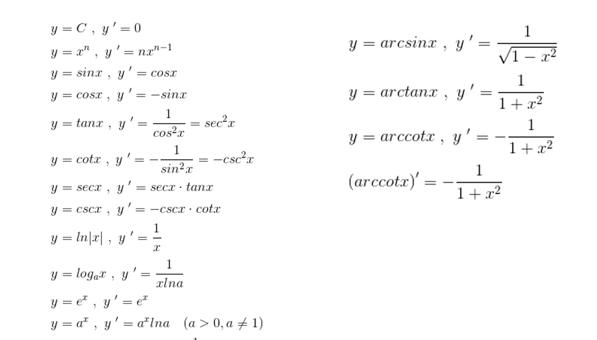
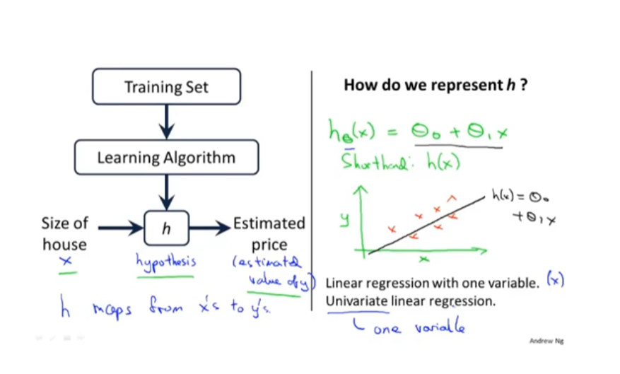

**人工智能三大关键：** 算法、算力、数据

机器学习核心目标：建立一个模型（函数），来描述输入（X）和 输出（Y）的映射关系

要点：

- 有一定数量的训练样本
- 输入和输出有关联关系
- 输入和输出可以数值化表示
- 任务需要有预测价值

**建模之前思考输入输出有没有关系**

网络结构：

- Embedding层：将整数序列转化为共同维度的向量序列（矩阵）
- 全连接层（线性层）：公式:y = w * x + b
- 循环神经网络（RNN） h^(t)=tanh(b + Wh^(t-1) + Ux^(t)
- 卷积神经网络（CNN）
- 池化层
    - 降低了后续网络层的输入维度，缩减模型大小，提高计算速度
    - 提高了Feature Map 的鲁棒性，防止过拟合
- Dropout层
    - 强迫一个神经单元，和随机挑选出来的其他神经单元共同工作，消除减弱了神经元节点间的联合适应性，增强了泛化能力
- 批归一化层（BN层）：
    - 对输入BN层的张量进行数值归一化，使其成为均值为零，方差为一的张量。
- 激活函数-Sigmoid: 公式： θ(x) = 1 / (1 + e^(-x))
- 激活函数-Tanh: 公式： tanh(x) = sinh(x) / cosh(x) = (e^x - e^(-x)) / (e^x + e^(-x))
- 激活函数-ReLU: 公式： Relu = max(0, x)

损失函数：

- 均方误差损失函数（MSE）：对均方差在做开根号，可以得到根方差
    - 适合回归任务
- 交叉熵损失函数（CE）：H(p,q) = - ∑xP(x) * logq(x)
    - 常用于多分类任务

常见导数: （导数用来计算梯度）

优化器 （根据梯度，控制调整权重的幅度）

- SGD（随机梯度下降）
- Adam（自适应矩估计）

中文分词

- 基于词典的算法
- 基于机器学习

tf-idf算法：是一种衡量文本中词语重要性的量化指标

- 词频（TF）：词频（TF）表示某一词在文档中出现的频率，词频越高，说明这个词在文档中越重要。
- 逆文档频率（IDF）：逆文档频率，反映了一个词语在整个语料库中的普遍性，IDF值越高，说明词语在语料库中越独特，越具有区分不同文档的能力

### 监督学习

- 根据数据集来预测这个房子能卖多少钱。（预测问题）
- 根据数据集来判断 乳腺肿瘤是恶性还是良性。（分类问题）

  假设分类不只是一两种，越来越多，需要一个算法来

#### 课后思考

假设你经营一家公司，你想开发学习算法来处理两个问题

1. 你有很多同一件货物的库存，假设你有几千件相同的货物要卖，
   你想预测接下来三个月你能卖出多少件
2. 你有很多用户，你想写一个软件来检查每一个客户的账户，
   对于每个客户的账号来判断这个账户是否被入侵或破坏

   这些问题应该被归为 分类问题 还是 回归问题

### 无监督学习
给他大量数据，要求它找出数据的类型结构

### 模型
- m 表示训练样本
- x 表示输入自变量
- y 表示输出因变量
- (x, y) 表示一个样本
- (x^(i), y^(i)) 表示第 i 个样本

#### 线性回归 

### 贝叶斯算法
常常和全概率公式结合

### SVM
SVM 支持向量机   
- 支持向量：离超平面最近的那些点
- 核心思想： 
  - 低维度转为高维度
  - 使用 `核函数` 来对高维度来进行 `内积`，不需要转化高维度