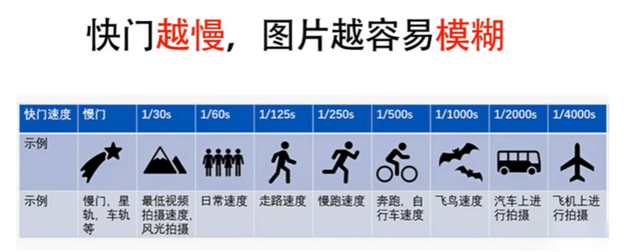
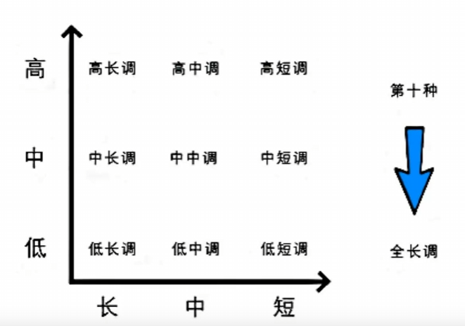

### 曝光三要素

- 快门
- 光圈
- ISO（感光度）

#### 安全快门

- 常用于镜头的 1 / 镜头数字
- 人文题材 新闻题材 1 / 125
- 行人 跑动的小孩 1 / 500

##### 快门例图

#### 光圈怎么选取

1. 需求：人物 静物 主体突出 背景虚化 等情况 选取 大光圈 （通常 F/2.8）
    - 大光圈可能出现跑焦情况，一般采用相机最大光圈 减个 挡位
2. 需求：人文纪实 主体突出 保留一定的背景层次 （通常 F/5.6）
3. 需求：风光 产品 商业人物 全局清晰 （通常 F/11）

- 大光圈突出主体
- 小光圈突出环境

#### 光圈冷知识

- 在没有大光圈情况下，可以调整人物与背景的距离来实现虚化效果

##### 找最佳画质光圈

在最大光圈 缩小 2到3个挡位，每个挡位 * 1.4

#### 感光度判断 (80%按照这个来)

1. 环境亮度 足够。太阳光 室内光线充裕 IS0: 100
2. 环境亮度 一般。阴天、树荫、 室内光线一般 IS0: 200 - 320
3. 环境亮度 较弱般。清晨、傍晚、、夜景 室内 IS0: 640 - 800

- 感光度提高亮度会亮，画质会降低
- 可以采用补光来提高亮度

### 相机挡位

- AV模式：光圈优先，满足日常人像、日常静物摄影
    - **光圈**、**感光度**可调，**快门**速度自动，**曝光补偿**有效
- TV模式：快门优先，满足日常风光、运动摄影
    - **快门**、**感光度**可调，**光圈**自动，**曝光补偿**有效
- P档： **感光度**可调， **快门**、**光圈**自动，**曝光补偿**有效
- M档： 全部可调， **曝光补偿**无效
- A+档： 全自动挡位

### 机位

定义：相机与模特的**三维**位置   
三维： 高度、角度、距离

- 高度：
    - 平视机位: 相机与相机**取景框**中的 中心对焦点 持平
        - 优势：
            1. 真实感 （证件照、肖像、人文纪实）
            2. 突出人物情绪 --- 近景、特写
        - 劣势：
            1. 平平无奇
                - 不拍 远景 全景 中景
    - 高机位
    - 低机位
- 角度：
    - 正面
    - 侧面
    - 背面
- 距离：（取景范围）
    - 远
    - 全
    - 中
    - 近
    - 特

#### 提高 平视机位 拍摄水平

平视机位可以稍微 抬高 或则 抬低 （一般高 15°、低 15°）

##### 强化：

镜头语言：

1. 拍摄风格：甜美-高 欧美-低
2. 人物情绪： 开怀大笑-小孩-高-共鸣

规避：
底层逻辑： 近大远小

1. 人物五官-三庭五眼
   

### 人体美姿规律

人体通过 点、线、 面 构成

#### 看面的眼光：

1. 脸面
2. 胸面
3. 腿面

保证美资自然度的方法 - 破面，让脸面、胸面、腿面 三面不都在**同一个平面**上

1. 破脸面的方法： 侧脸、挡脸、不取完整的脸、光影破面
2. 破胸面的方法： 叉腰、转身、提臀、遮挡
3. 破腿面的方法： 踮脚、交叉、弯曲

#### 看线的眼光：

1. 头线
2. 胸线
3. 腿线

保证美资自然度的方法 - 破线， 让头线、胸线、腿线 三线不都在**同一条直线**上

1. 破头线： 歪头（倒头）
2. 破胸线： 叉腰、转身
3. 破腿线： 踮脚、交叉、弯曲

##### 线条需注意：

1. 线条要流畅 (避免出现”急转弯“)
2. 线条要完整 (避免出现”缺胳膊少腿“)

##### 线的形态：

1. S型 - 柔和、性感
2. 三角形 - 气场、直线
3. 上紧下松
4. 上松下紧

#### 调整美姿顺序：
腿 -> 胸 -> 脸

### 影调
光影 - 色调     
光影：明暗关系：
- 暗 - 低调
- 灰 - 中调
- 亮 - 高调

**直方图**分析影调：
- 直方图 横轴 分为 左、中、右 三部分，分为 暗、灰、亮
- 直方图 纵轴 的 峰 是指图片的 色彩信息、像素细节

#### 影调的目的
1. 情感表达： 通常人像
   - 低调 传达的是 压抑、沉闷等感情
   - 高调 传达的是 积极、欢快、愉悦等情绪
   - 中调 传达的是 平和、平静、自然等情绪
2. 氛围渲染： 通常风光
3. 塑造造型

##### 影调分析
1. 低长调 - 暗 灰 亮 - 层次丰富